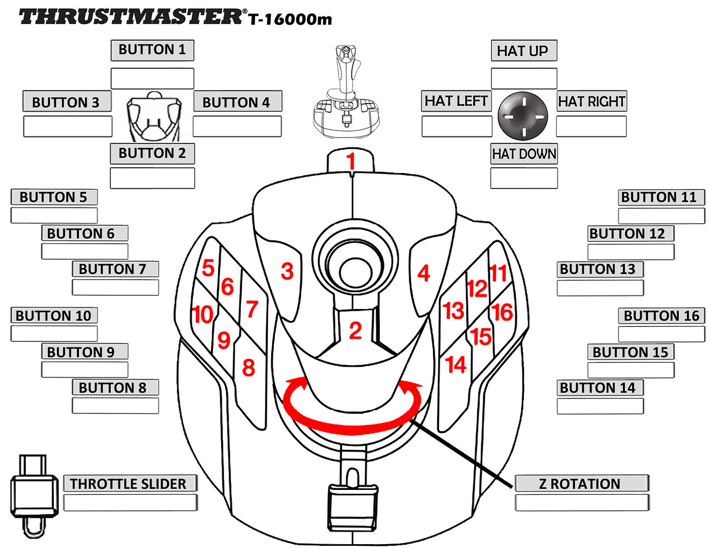
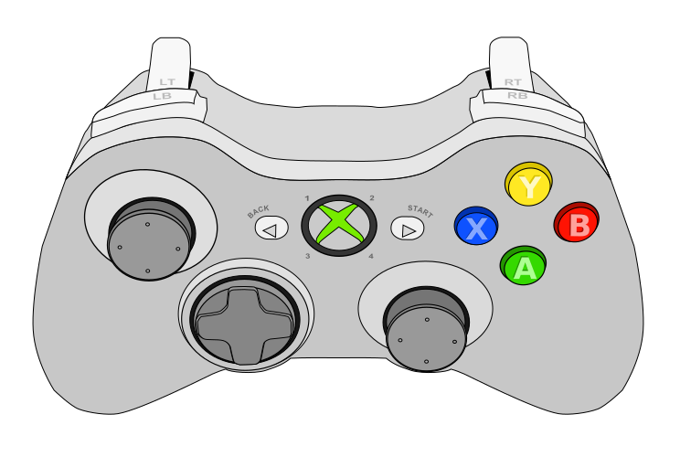
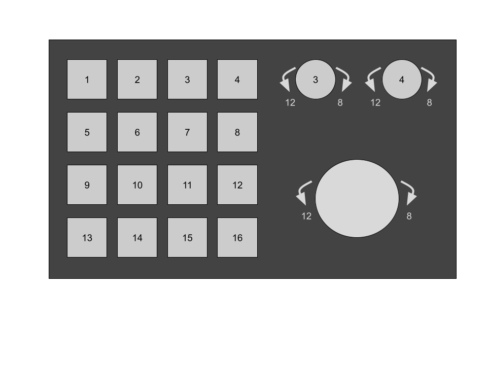

# Operator Interface

For our [2024 robot](../src/main/java/com/team766/robot/reva/Robot.java), we have controls set up for the [Driver](#driver-controls), [Box Op](#boxop-controls), and for [Debugging](#debug-controls) (eg, in the pit).  This document provides an overview for each of our controls.

The top-level code is in [`src/main/java/com/team766/robot/reva/OI.java`](../src/main/java/com/team766/robot/reva/OI.java) and is organized into separate classes for each of the separate sets of controls.

## Driver Controls
Code: [`src/main/java/com/team766/robot/common/DriverOI.java`](../src/main/java/com/team766/robot/common/DriverOI.java).

The driver controls the movement of the robot on the field.  They also include game piece manipulation that is best done by the driver, such as shooting a gamepiece towards the target.  We use the [Thrustmaster T.16000M](https://www.amazon.com/Guillemot-Thrustmaster-T-16000M-Fcs-Joystick/dp/B01H6KXGEI) joysticks for these controls.

We use the same basic driver controls that we use on any of our swerve-drive based robots.  In fact, the code for these controls is in a common directory alongside the [swerve](SwerveDrive.md) [code](../src/main/java/com/team766/robot/common/mechanisms/Drive.java) itself, and may be subclasses to allow for binding game-specific controls (eg binding the left trigger to fire the shooter), though we have not made any such customizations yet.

TODO: consider this customization.

<table style="table-layout: fixed">
  <tr>
    <td style="width: 50%">
    
  </td>
  <td style="width: 50%">
      
  </td>
  </tr>
  <tr>
    <td><strong>Drive</strong></td>
    <td><strong>Steer</strong></td>
  </tr>
  <tr>
    <td><strong>X-axis:</strong> Move forward/backward</td>
    <td></td>
  </tr>
    <tr>
    <td><strong>Y-axis:</strong> Move left/right</td>
    <td><strong>Y-axis:</strong>Rotate counterclockwise/clockwise</td>
  </tr>
  <tr>
    <td><strong>Button 1 (Trigger)</strong>: Target lock (hold to auto-aim at speaker, release to stop)</td>
    <td><strong>Button 1 (Trigger)</strong>: Fine driving (slow down to 25%)</td>
  </tr>
  <tr>
    <td><strong>Button 15</strong>: Reset position (odometry)</td>
    <td><strong>Button 3</strong>: Shoot note</td>
  </tr>
    <tr>
    <td><strong>Button 9</strong>: Reset gyro</td>
    <td></td>
  </tr>
  <tr>
    <td colspan="2"><strong>NOTE: X-axis is up/down, Y-axis is sideways</strong></td>
  </tr>
</table>

## BoxOp Controls
Code: [`src/main/java/com/team766/robot/reva/BoxOpOI.java`](../src/main/java/com/team766/robot/reva/BoxOpOI.java).

The box operator (box op) controls the manipulation of the non-drive mechanisms on the robot, such the the shoulder, intake, and shooter.

We use a wired Xbox Controller (the Logitech gamepad in Xbox mode also works for testing) for these controls.

<table>
  <tr>
    <td colspan="2">
    
  </td>
  </tr>
  <tr>
  </tr>
  <tr>
    <td>A</td>
  <td>Move shoulder to floor</td>
  </tr>
  <tr>
    <td>B</td>
  <td>Move shoulder to secondary amp shooting position</td>
  </tr>
 <tr>
    <td>X</td>
  <td>Move shoulder to climber balancing position</td>
 </tr>
 <tr>
    <td>Y</td>
  <td>Move shoulder to amp shooting position.</td>
</tr>
 <tr>
    <td>DPAD UP</td>
  <td>Nudge shoulder up.</td>
</tr>
 <tr>
    <td>DPAD DOWN</td>
  <td>Nudge shoulder down.</td>
</tr>
 <tr>
    <td>RT</td>
  <td>Hold to spin shooter</td>
</tr>
 <tr>
    <td>LB</td>
  <td>Hold to run intake (in)</td>
</tr>
<tr>
    <td>RB</td>
  <td>Hold to run intake (out)</td>
</tr>
<tr>
    <td>A+B+LEFT STICK</td>
  <td>Hold buttons + move stick to control left climber</td>
</tr>
<tr>
    <td>A+B+RIGHT STICK</td>
  <td>Hold buttons + move stick to control right climber</td>
</tr>
<tr>
    <td>A+B+X+Y</td>
  <td>Hold to override climber soft limits</td>
</tr>
</table>

The face buttons are also mapped to the buttons on the back of the Xbox Elite Controller

## Debug Controls
Code: [`src/main/java/com/team766/robot/reva/DebugOI.java`](../src/main/java/com/team766/robot/reva/DebugOI.java).

The debug controls allow us to test each of the individual mechanisms on the robot, for bringup and for pit testing (eg in between matches).

We use a [Megalodon Macro Pad](https://www.amazon.com/KEEBMONKEY-Megalodon-Programmable-Designer-Keyboard/dp/B0C1SV9G9L) with [custom firmware](https://github.com/Team766/qmk_firmware) (providing joystick inputs) for our debug controls.

TODO: put together page with instructions on how to flash the firmware.

<table>
  <tr>
    <td colspan="2">
    
  </td>
  </tr>
  <tr>
    <td>1</td>
    <td>Hold to control shoulder (with up/down or dials)</td>
  </tr>
    <tr>
    <td>2</td>
    <td>Hold to run shooter.  Can speed up and slow down (with up/down or dials).</td>
  </tr>
  <tr>
    <td>3</td>
    <td>Hold to control left climber (with up/down or dials).  Bypasses soft limits.
  </tr>
  <tr>
    <td>4</td>
    <td>Hold to control right climber (with up/down or dials).  Bypasses soft limits.
  </tr>
  <tr>
    <td>5</td>
    <td>Hold to run intake (in)</td>
  </tr>
  <tr>
    <td>6</td>
    <td>Hold to run intake (out).</td>
  </tr>
  <tr>
    <td>8</td>
    <td>Moves mechanism being controlled (via another button) up.</td>
  </tr>
  <tr>
    <td>12</td>
    <td>Moves mechanism being controlled (via another button) down.</td>
  </tr>
  <tr>
    <td>16</td>
    <td>Reset relative encoders on climber.</td>
  </tr>
</table>
