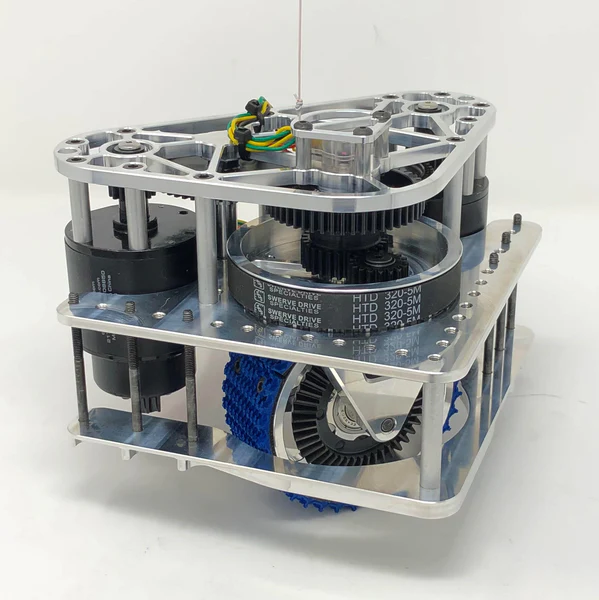

# Swerve Drive

## What is swerve drive?

Swerve drive is a type of drive train that allows for independent control of each wheel. This allows for the robot to move in any direction, and rotate in place. It also allows for the robot to move sideways or rotate while moving linearly, which is useful for many games.

## How does swerve drive work?

### Mechanical concepts:

Swerve drive works by having each wheel connected to a motor that can rotate 360 degrees. Each wheel has a steering and a driving motor. The steering motor rotates the wheel, and the driving motor rotates the wheel and the robot.

Here is an example of a swerve drive module (mk4i):

As you can see, there are 2 motors which control the orientation and speed of the wheel. There is also an absolute encoder (currently a CANcoder) that allows the robot to know the orientation of the wheel even after it is fully turned off.

When 4 of these modules are connected to a robot, it can move and rotate in any direction, effectively disconnecting the rotation from the translational movement of the robot.

### Basic Programming:

The movement of a swerve drive can be broken into two main components: translating and rotating. We can represent both of these using vectors for the desired movement of each swerve module (with the magnitude and direction of the vector representing the drive power and wheel angle, respectively), allowing us to later add the vectors to get one desired power and angle for each module.

The translation is the easier component, as it requires a single direction and magnitude that all modules use, illustrated in the image below. By converting the overall translational speed or movement inputs from a joystick input or `chassisSpeeds` into a vector, we can find the required angle **θ** to move in that direction by taking the inverse tangent of its components and the required power with its magnitude.

TODO: ADD IMAGE

Turning is slightly more difficult, due to each wheel needing a unique steer angle to rotate properly. For any swerve drive (even non-square ones), turning in place involves aligning each wheel to be tangent to the circle and applying power based on the desired angular velocity, meaning we need a vector tangent to this circle.

To create this tangent vector, we can assign each module a position relative to the center of the robot, which can be visualized as the radius to the turning circle. Thus, a vector perpendicular to this position is perpendicular to the radius and tangent to the vector. By scaling this vector to have a magnitude of the desired turn power/angular velocity, we create a vector for each swerve module based on its position that allows to robot to spin in place.

TODO: ADD IMAGE

Now that we have the concepts for both translation and turning, we can combine them to get a single vector for each module representing the wheel's spin and power. This is achieved by the expression: 
**[module]**`.driveAndSteer(new Vector2D(x, y).add(turn, createOrthogonalVector(`**[module location]**`).normalize()));`

First, we create a new vector using the inputted x and y speeds, representing the translational movement. We then add a second vector for the rotational movement, consisting of the vector perpendicular to the module location scaled down to a magnitude of one and subsequently scaled by the turn power. The combined vector is inputted to a method that converts it to a drive power and steer angle, and applied to the specified swerve module. This is repeated for each module, successfully controlling the robot!

## Additional functionality

There are a few additional features that swerve drive needs to function properly and conveniently:
- Field oriented control
- Absolute encoder wheel alignment
- Cross wheels

### Field oriented control

The previosuly found vectors for each wheel to control the robot work perfectly for moving the robot if the driver is oriented the same direction as the robot. However, if this is not the case, pushing forward on the joystick would move the robot towards its own forward direction, rather than the static and more intuitive field oriented forward. This would not be a solvable issue on a different drive train like west coast, but since a swerve drive separates the robot's angle from its position, this can be corrected for.

We do this by rotating the input vector based on the yaw of the robot, recorded by the gyro. This is easily achievable by using a rotation matrix (which only needs to be two dimensional), which is in short a set of sines and cosines which rotate the specified vector by a specified angle when applied to its x and y coordinates. By using the negative yaw as this angle, we counteract the turning of the robot's forward direction compared to the driver's forward direction, allowing for field oriented control.

### Absolute Encoder Wheel Alignment

When the robot is turned off, the relative encoders that allow the motors to move to a specific position do not measure the change in the wheels' angle. It is therefore imperative to use absolute encoders to track this movement and find the offset of the relative encoders from their actual position so that we can add this offset to the applied rotation value. To do this, we find the difference between the absolute angle and the relative angle for each module and store it as a constant (as it will not change when the robot is turned on).

### Cross wheels

Although this feature is not nearly as essential to the functionality of swerve drive, it is still incredibly useful for some situations or games, such as the seesaw charge station in 2023's competition **Charged Up**. To resist robot movement, we can orient the wheels to a crossed posistion so that there is no orientation in which all wheels can freely roll. This is done by setting the wheel angle for each module to the vector parallel to the the position of the module (rather than perpendicular to it).

## Benefits of swerve drive

* **Agility.** Because swerve can move in any directions and rotate, it is very easy to avoid defense from other robots. It is also easier to move around the field and score points for most objectives.
* **Easier to drive.** Because swerve drive has field oriented controls (rather than robot oriented like some drives), it is significantly easier to drive and utilize rotation.
* **Strafing.** Similar to the speed and agility swerve provides, it can be helpful to move left or right without rotating the robot. For instance, this allowed us to triple balance in **Charged Up**.

## Limitations of sweve drive

* **Very expensive.** The swerve modules are very expensive and include two motors, so are hard to replace.
* **Very complex.** Swerve drive has high mechanical, electrical, and software complexity, and therefore has a higher chance of failing than other drives.
* **Draws a lot of power.** Swerve drive's 8 motors draw a lot of power, so it is **nessessary** to limit the amount of amps drawn by each motor on the robot.
* **High CAN bus load.** Because there are 8 motors and a gyro involved in swerve, it needs its own can bus.

## How to use swerve drive

### Bringup

To allow the swerve code to properly control the modules, we need to configure and align them. This is primarily done using the config file and Phoenix Tuner X.

First, write down and/or change the CAN IDs for each motor or gyro. It is helpful to rename the motors in phoenix tuner as position (like front left) and type (drive or steer). Input these IDs in the config file under the section for the motor, along with the type of the motor controller/gyro (for Falcons and Krakens, this would be `"TalonFX"`, and for pigeons, this would be `"Pigeon2"`). **You also must add the CAN bus if using a CANivore**.

Once the code can address and read from each motor, we must calibrate the absolute encoders to point in the desired direction. Rotate each motor forward using the joystick, and note which way each wheel spins. Then, disable the robot and orient each wheel so that powering each wheel would move the robot towards its front side. Finally, zero each absolute encoder in Tuner X, shown in the image below.

TODO: ADD IMAGE

The steer motors will not move at all with no PID values input, so add placeholder values for now. These can be copied from previous drive PID values, which should work most of the time.

Next, control the robot and log the values returned by the absolute and relative steer encoders. Ensure that both have positive rotation as counterclockwise. If not, invert them in Tuner X (or the config if necessary).

At this point, the robot will most likely already work fine and be ready for use. However, it is also possible that the PID values need re-tuning, which would cause either slow wheel movements or oscillation. If necessary, tune the PID for each steer motor directly in phoenix tuner and/or in the config. In the past, we have only needed P and D.

Swerve is now all set up!

### Initialization

Since swerve drive is a common mechanism, there are some variables specific to each robot that you will need to pass in. These are contaned in the `SwerveConfig` class, which can be initialized in `Robot.java` with information about location of wheels, CAN bus, and current limits.

Calling `Drive(config)` will initialize the mechanism with the created config. This will initialize the motors, encoders, gyro, and odometry.

### Running swerveDrive

To use swerve drive, call the `controlFieldOriented` procedure in the `Drive` mechanism. This method takes 3 parameters:

* `x` - The x component of the vector to move in. Positive x is forward.
* `y` - The y component of the vector to move in. Positive y is left.
* `rotation` - The amount to rotate the robot. Positive rotation is counterclockwise.

These inputs can be from the joysticks in `OI`.

You can also input a `chassisSpeeds`, which is useful for path following.

The methods `stopDrive()` and `setCross()` can also be useful, causing the robot to stop its drive motors and orient the wheels in a cross as described earlier, respectively.

Additionally, since both gyro and odometry run through drive, the getter and resetter methods for the current position and rotations (yaw, pitch, roll) are called from `Drive`.